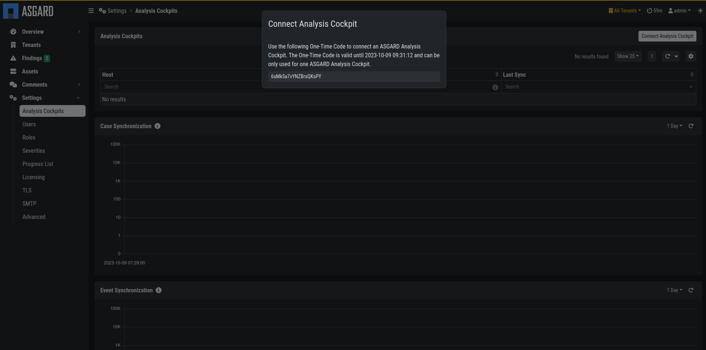
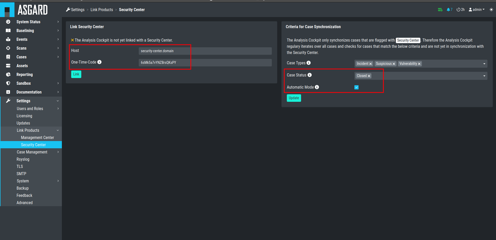
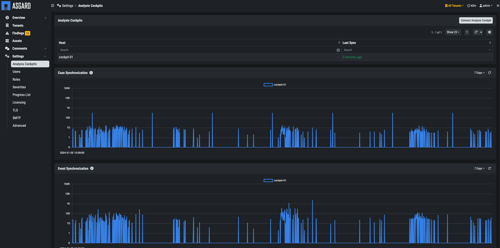

.. index:: Connect your Analysis Cockpit

Connect your Analysis Cockpit
=============================

In order to get data from your Analysis Cockpit into
the Security Center, we need to connect both systems
first. This can be done via the Web UI of both systems.

Prepare your Security Center
^^^^^^^^^^^^^^^^^^^^^^^^^^^^

To connect your Analysis Cockpit with your Security Center,
you have to navigate to ``Settings`` > ``Analysis Cockpit``.

Click ``Connect Analysis Cockpit`` in the top right corner.
This will generate a **One-Time Code** which is valid for
two hours. We need this code in our Analysis Cockpit now.

   Security Center Connect Analysis Cockpit

Before your connect
^^^^^^^^^^^^^^^^^^^

Before you connect your Analysis Cockpit to your Security Center,
decide which cases should be synchronized to the Security Center.
Keep in mind, that once synchronized, data will remain on the
Security Center, even if synchronization criteria are modified.

We recommend to only synchronize cases that contain actionable
information, which is fully analyzed and finally validated.
For that reason, we recommend to only synchronize data with
a case status of ``Closed``. In this situation, ``Closed`` means
that the analysis is finished.

It is important to understand that a case with status ``Closed``
will lead to one or more ``Findings`` being opened within the
Security Center. The actual remediation is then tracked within
the Security Center.

Configure your Analysis Cockpit
^^^^^^^^^^^^^^^^^^^^^^^^^^^^^^^

Log into your Analysis Cockpit and navigate to ``Settings`` >
``Link`` > ``Security Center``. 

   Connect Analysis Cockpit

The **Automatic Mode** will automatically flag all cases in your
Security Center, which match the criteria from ``Case Types`` and
``Case Status``.

.. important::
   As with all our products, you have to use a FQDN to connect
   the Analysis Cockpit with your Security Center. Make sure
   that the Analysis Cockpit can resolve the FQDN of the Security
   Center and reach it via the necessary port.
   
   You can have find the needed network ports in the chapter
   :ref:`requirements/network:analysis cockpit`.

Once you connected your Analysis Cockpit to your Security Center,
you can find the status and some statistics in your Security Center
in ``Settings`` > ``Analysis Cockpit``.

   Connected Analysis Cockpit