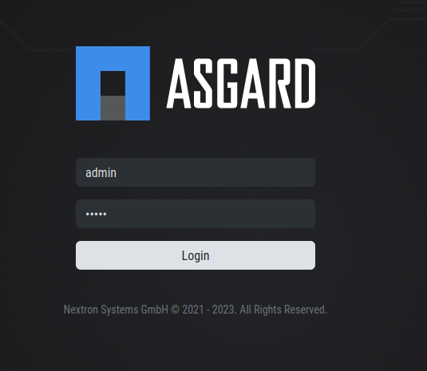
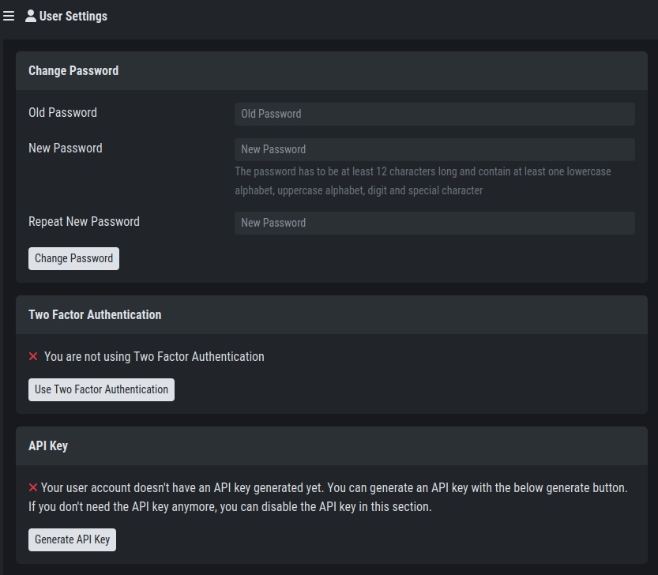

.. index:: Credentials

Credentials
===========

You can log into the Backend with the following default credentials.
The admin user will work for both Frontend and Backend, but for the
initial configuration, we recommend to perform the next steps on
your backend.

- User: ``admin``
- Password: ``admin``

   Security Center Login Page

After you logged in for the first time, you have to change the
default password before you can continue.

The password has to be at least 12 characters long and contain
at least one lowercase alphabet, uppercase alphabet, digit and
special character.

After you have changed the default password, we advise to set up
the second factor. You can do this by clicking your username in
the top right corner and navigating to ``User Settings``.

   Security Center User Settings

.. warning:: 
   The ``admin`` user has access to all tenants. Use this user
   only for administrative tasks, as you will have access to all
   the sensitive data within the Security Center.