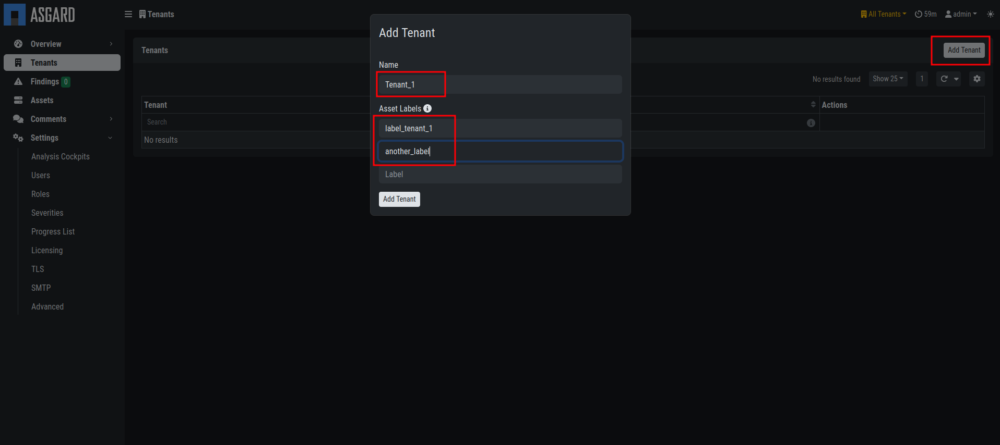
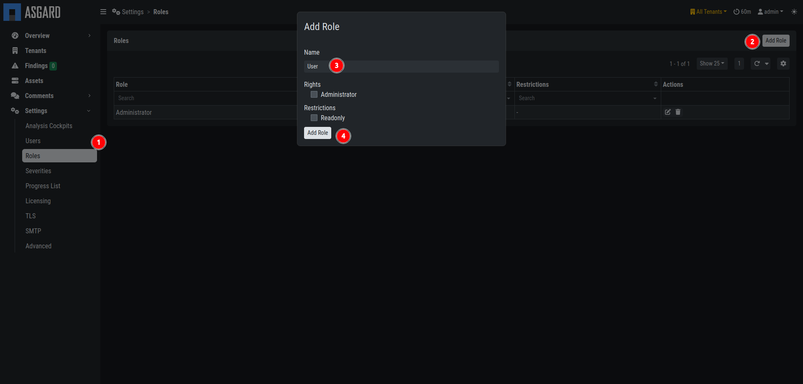
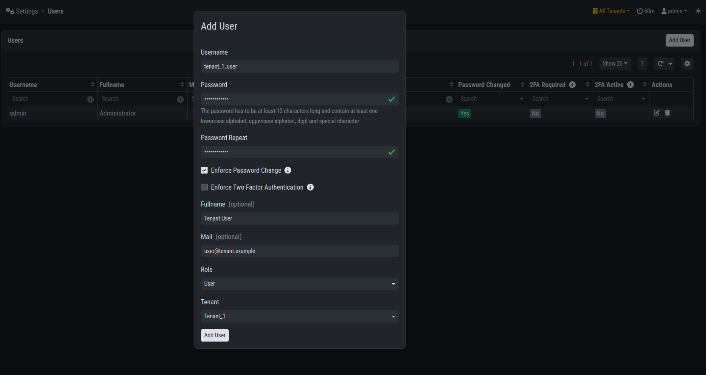

.. index:: Tenants

Tenants
=======

In this chapter we will create our first tenant.
All of the configuration will again be done in your
Backend (port 8443 HTTPs).

Setting up your first Tenant
^^^^^^^^^^^^^^^^^^^^^^^^^^^^

Open your browser and connect to the Security Center
Backend. After logging in with your administrative credentials,
navigate to ``Tenants`` and click ``Add Tenant`` in the top
right corner.

   Security Center new Tenant

Choose a ``Name`` for the tenant and the ``Asset Labels``
associated with this tenant. The labels are used to assign
assets from the Analysis Cockpit to a tenant. An asset will
be assigned to a tenant, if it has at least one of the labels
selected.

You can always modify the labels for a tenant by clicking the
``Edit`` button in the ``Actions`` column.

.. danger:: 
   It is important to understand that an asset is assigned to
   a specific tenant the moment it first shows up with a label
   that fits to this specific tenant. Changing the label at a
   later point will **NOT** cause the asset to be assigned to
   another tenant.

.. hint::
   To automatically assign assets to the correct tenant,
   service providers can create a tenant specific agent installer
   (on the ASGARD Management Center) with a preset and unique
   label for every tenant. This agent installer can be provieded
   to the specific tenant for installation.

Create a User Group for your Tenant
^^^^^^^^^^^^^^^^^^^^^^^^^^^^^^^^^^^

You can create an optional ``User`` User Group for the
Security Center. This can be used to assign to non-administrative
users of the Security Center. Individual Users will be assigned
to a tenant with those permissions.

To do this, navigate to ``Settings`` > ``Roles`` and click
``Add Role`` in the top right corner.

   Security Center User Group

Create a User for your Tenant
^^^^^^^^^^^^^^^^^^^^^^^^^^^^^

You can find all the users in ``Settings`` > ``Users``. Here you
can create new users for your tenants. You will also find the admin
user, which is assigned to ``All Tenants``. Create a new user
by clicking ``Add User`` in the top right corner.

   Security Center new User

Make sure to use the correct role and tenant for this user, as this
will determine what the user can access.

.. hint:: 
   Currently you can only create normal user accounts for a tenant.
   In future version you will be able to create tenant-specific
   administrative accounts, which will be able to create users
   for their own tenant.

The tenant users should use the Security Center Frontend
to access their data. See :ref:`requirements/network:customer access`.