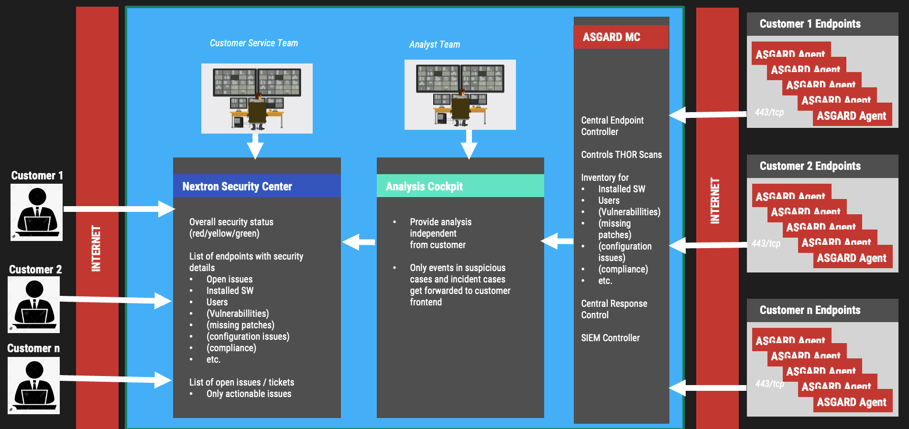

.. index:: General Understanding

Before You Begin
================

The Nextron Security Center is intended to provide multi tenancy support
to single ASGARD installations. It connects to the Analysis Cockpit and
synchronizes data provided in cases within the Analysis Cockpit.

All assets assigned to a specific tenant within the ASGARD Management
Center will be synchronized to this tenant in the Analysis Cockpit
and finally to the Security Center.

In a service provider setup, a team of analysts would be working on event
analysis and would use the Analysis Cockpit for that. Event analysis is
independent from specific tenants. A case created in the Analysis Cockpit
can affect one or more tenants.

If a case meets pre-defined criteria its content gets synchronized to
the Security Center and leads to the creation of one or more findings
for one or more tenants within the Security Center.

The Security Center provides the option for a second service provider
team that is intended to assist the customers (tenants) with the findings.
Communication between customers and the customer service team can be done
through the “Comments” function within the Security Center.

The following image shows an architecture overview with all products and
their communication relationships.

In the figure above, the Security Center – which consists of the Security
Center Frontend and the Security Center Backend – is shown as a single
functional block. Security Center Frontend and Security Center Backend
can be installed in separate DMZ networks if required. This is optional
however.