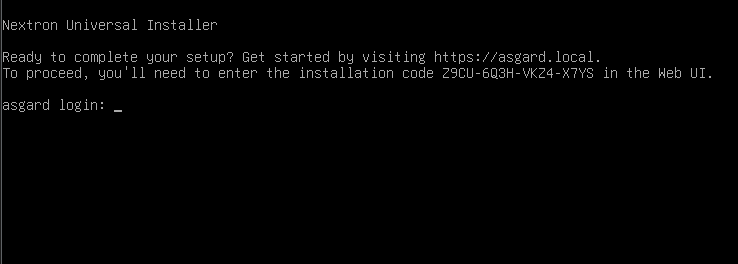
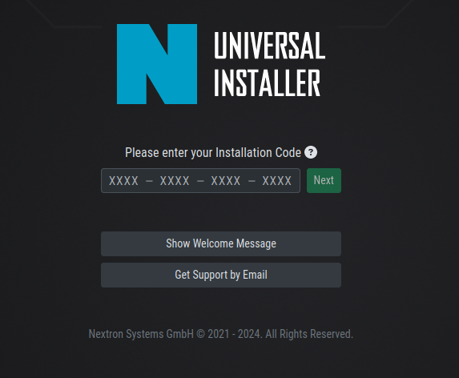
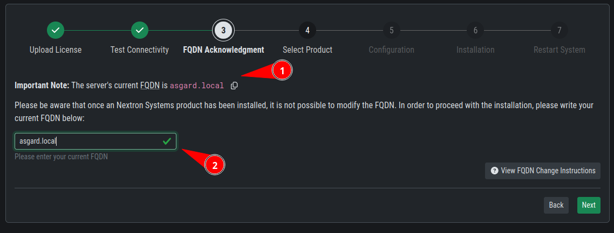
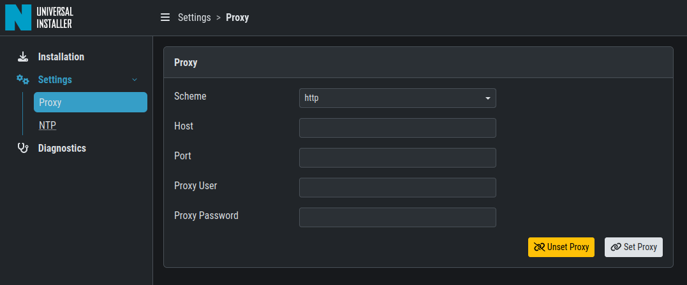
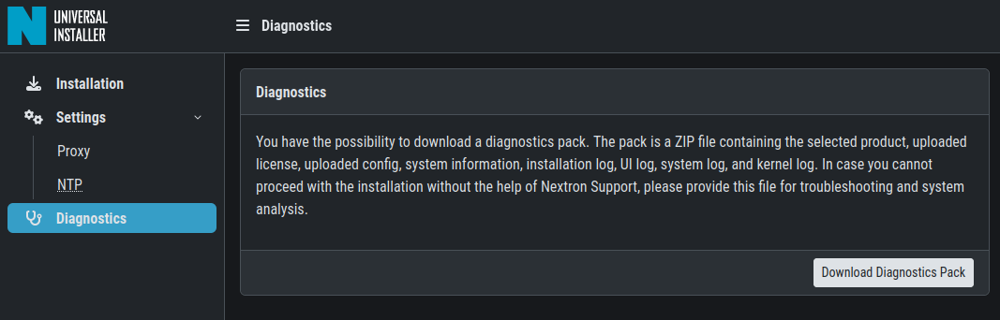

.. index:: Components

Installing the Components
=========================

This chapter will explain how to install the Security Center components
on your server(s). We recommend to start with the Backend, since the
Frontend installation requires the configuration of the Backend.

Please keep in mind that you can install the Frontend and Backend on
two separate servers. For simplicity, we chose to install both services
on the same server. If you wish to install the Frontend and Backend on
two separate servers, please see :ref:`setup/components:installing two seperate servers`.

Install the ASGARD Security Center (All-in-one)
-----------------------------------------------

The Nextron Universal Installer is a web based installer
which will guide you through the installation of our
ASGARD products. The Nextron Universal Installer will install
**one** of the following products on your server (this manual
focuses on the ``ASGARD Security Center (All-in-one)``):

- ASGARD Management Center; alternatively if your license permits:
  
  * ASGARD Broker
  * ASGARD Gatekeeper
  * ASGARD Lobby

- Master ASGARD

- ASGARD Analysis Cockpit; alternatively:
  
  * Elasticsearch Cluster Node for ASGARD Analysis Cockpit

- ASGARD Security Center, in the following variants:

  * ASGARD Security Center (Backend Only)
  * ASGARD Security Center (Frontend Only)
  * ASGARD Security Center (All-in-one, unrecommended)

.. note::
   You can only install one product on one server, since the
   products are not designed to coexist on the same server.
   The exception being the ASGARD Security Center (All-in-one).

The installation takes roughly between 5-15 minutes, depending
on your internet connection and the server you are installing
the product on.

If you encounter problems during your installation, please see
:ref:`setup/components:diagnostic pack` for further instructions.

Requirements
~~~~~~~~~~~~

The installation of the ASGARD Management Center requires
the following:

- A valid license file for the ASGARD Security Center
- A configured FQDN (with some exceptions, see :ref:`setup/components:valid fqdn`)
- Internet access during installation (see :ref:`setup/components:connectivity check`)
- Every Server must have a valid and resolvable FQDN (see :ref:`setup/network:network configuration`)

Installation
~~~~~~~~~~~~

After the ISO installer is finished with the setup,
you will be greeted at the console login prompt with
the following message:

Follow the instructions and navigate to the webpage
displayed on your console. You will most likely get
a browser warning when you connect the first time to
the page. This is due to the page using a self signed
certificate, since it will only be used to install the
ASGARD Security Center. You can safely ignore this
warning and proceed to the page.

You will be greeted with a small introduction as to what
the Nextron Universal Installer is and what it does. After
you click ``Next``, you will be presented with the landing
page of the Nextron Universal Installer.

Enter the Installation Code from the terminal and click
``Next``. The Installer will now guide you through the
installation.

Connectivity Check
~~~~~~~~~~~~~~~~~~

The Nextron Universal Installer will try to connect to our
update server in order to download all the necessary packages
once the installation starts. Make sure you can reach the
update servers (see :ref:`requirements/network:internet`).

Please configure your proxy settings if you are behind a
proxy (see :ref:`setup/components:proxy and ntp settings`).

Valid FQDN
~~~~~~~~~~

The Nextron Universal Installer will prompt you to verify the
FQDN which you configured during the installation of the base
system (see :ref:`setup/network:network configuration`). This
is needed in order for your ASGARD Components to communicate via
a HTTPs connection with each other. If there is a mismatch of
FQDNs your components will not be able to communicate with each
other.

If the displayed FQDN is not correct, you can change it by
clicking on the ``View FQDN Change Instructions`` button.
This will open a dialog with instructions on how to change
the FQDN of your server. Once you have changed the FQDN,
you can continue with the installation.

Proxy and NTP Settings
~~~~~~~~~~~~~~~~~~~~~~

If you need to configure a proxy or change the NTP settings
of your system, you can do so by clicking on the ``Settings``
button in the left menu of the Nextron Universal Installer.

If you configured a proxy during the ISO installation, those
settings will be carried over into the Universal Installer.
The settings will also be carried over into your ASGARD
Security Center. The same goes for NTP.

Diagnostic Pack
~~~~~~~~~~~~~~~

In case of errors or problems during the installation, you can
download a diagnostic pack by navigating to the ``Diagnostics``
tab in the left menu of the Nextron Universal Installer. Click
on the ``Download Diagnostic Pack`` button to download the
diagnostic pack. You can then send the diagnostic pack to our
support team for further analysis.

Installing two seperate servers
-------------------------------

If you wish to separate the Frontend and Backend of the ASGARD
Security Center, you can do so by installing the Backend on one
server and the Frontend on another server. Simply choose one of
the options during the ``Select Product`` stage of the Nextron
Universal Installer.

.. hint::
   You have to start with the installation of the Backend, since
   the Frontend needs the configuration of the Backend to work
   properly.

ASGARD Security Center (Backend Only)
~~~~~~~~~~~~~~~~~~~~~~~~~~~~~~~~~~~~~

After the Nextron Universal Installer finished the installation of
the ASGARD Security Center Backend, you have to download the configuration
file from it (``model.config``). You can do this by connecting to the
server via SSH. The file can be found in the following directory:

``/etc/asgard-security-center-backend/model.config``

You can now start with the installation of the Frontend.

You can also check if the service of the Backend was installed successfully. 

.. code-block:: console
   
   nextron@gatekeeper:~$ systemctl status asgard-security-center-backend.service
   
The status of the service should be ``active (running)``.

The Backend is running on TCP port 8443. You can now log into the Backend via
``https://<FQDN>:8443``.

ASGARD Security Center (Frontend Only)
~~~~~~~~~~~~~~~~~~~~~~~~~~~~~~~~~~~~~~

During the installation of the ASGARD Security Center Frontend, you will
be prompted to upload the configuration file of the Backend. Use the file
(``model.config``) you downloaded earlier from the Backend. Once the installation
is finished, you can check if the service was installed successfully.

.. code-block:: console

   nextron@security-center:~$ systemctl status asgard-security-center-frontend.service

If the status of the service is ``active (running)``, the installation is finished.

You can now log into the frontend via ``https://<FQDN>``.