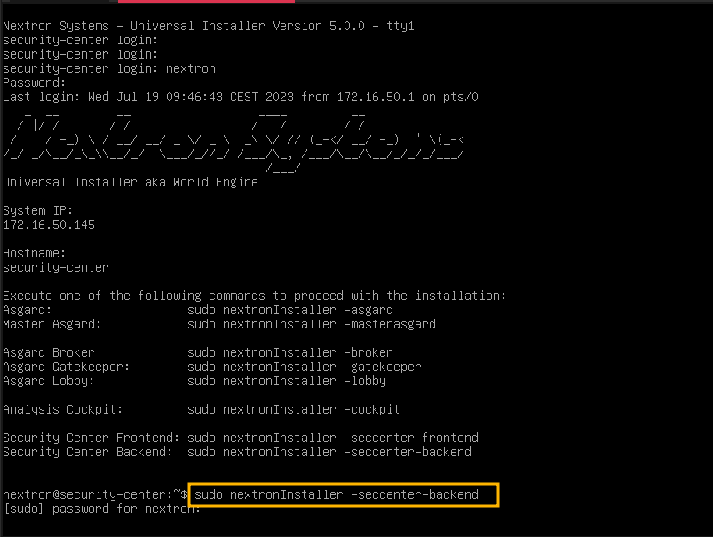
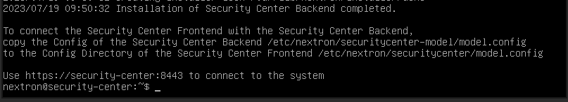
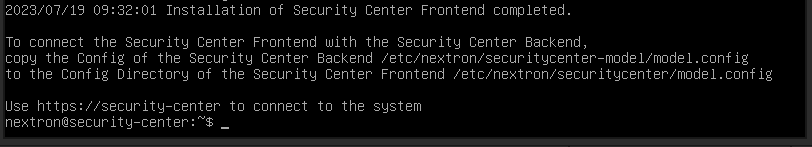

.. index:: Components

Installing the Components
=========================

This chapter will explain how to install the Security Center components
on your server(s). We recommend to start with the Backend, though the
order in which you install your components is not important.

Please keep in mind that you can install the Frontend and Backend on
two separate servers. For simplicity, we chose to install both services
on the same server.

If you also plan on installing both services on one server, make sure to
remove the lock file and create a new motd-file after you installed your
first service (Frontend or Backend). You can do this with the following
commands:

.. code-block:: console

   nextron@security-center:~$ sudo rm /var/lib/nextron/installer/done
   nextron@security-center:~$ sudo touch /etc/update-motd.d/01-nextron-setup

.. warning:: 
   For the next steps internet connectivity is required.

Installing the Security Center Backend
--------------------------------------

After the base installation of your server is completed, we can install the
backend application. To do this, connect to the server via SSH or use your
hypervisor's web console, and run the following command:

.. code-block:: console

   nextron@security-center:~$ sudo nextronInstaller -seccenter-backend

After the installation is done, you will see the following message:

You can now check if the service was installed successfully. 

.. code-block:: console
   
   nextron@gatekeeper:~$ systemctl status securitycenter-model.service
   
The status of the service should be ``active (running)``.

Installing the Security Center Frontend
---------------------------------------

After you have installed your Backend, we can install the frontend application.
To do this, connect to the server via SSH or use your hypervisor's web console,
and run the following command:

.. code-block:: console

   nextron@security-center:~$ sudo nextronInstaller -seccenter-frontend

.. figure:: ../images/setup_sc-frontend.png
   :alt: Installing the Security Center Backend

After the installation is done, you will see the following message:

You can now check if the service was installed successfully. 

.. code-block:: console
   
   nextron@gatekeeper:~$ systemctl status securitycenter.service

You will see that the service is in a ``failed/exited`` state. This will
change once we configured our Frontend. To do this, we can copy the the configuration
for our Backend into the directory of our Frontend.

On a single system installation, run the following command:

.. code-block:: console

   nextron@security-center:~$ sudo cp /etc/nextron/securitycenter-model/model.config /etc/nextron/securitycenter/model.config
   nextron@security-center:~$ sudo chown securitycenter: /etc/nextron/securitycenter/model.config

On a multi system installation, you have to copy the model.config file
from one server to another. You can use the built in tools of linux to
accomplish this.

After the file has been copied, make sure that the permissions are
correctly set:

.. code-block:: console

   nextron@security-center:~$ sudo ls -l /etc/nextron/securitycenter/model.config
   -rw------- 1 securitycenter securitycenter 7587 Jul 19 10:15 /etc/nextron/securitycenter/model.config

If somehow the permissions and owner are incorrect, use the following commands
to fix the issue:

.. code-block:: console

   nextron@security-center:~$ sudo chmod 600 /etc/nextron/securitycenter/model.config
   nextron@security-center:~$ sudo chown securitycenter: /etc/nextron/securitycenter/model.config

You can now restart the Security Center Frontend service:

.. code-block:: console

   nextron@security-center:~$ sudo systemctl restart securitycenter.service
   nextron@security-center:~$ sudo systemctl status securitycenter.service

If the status of the service is ``active (running)``, the installation is finished.