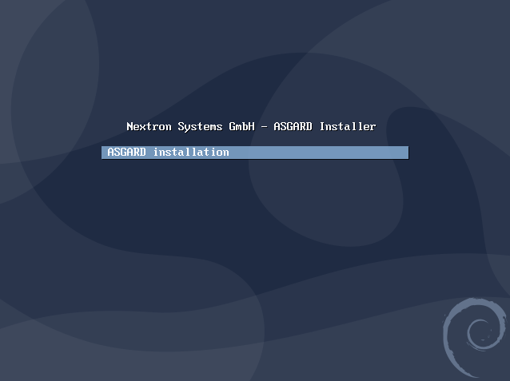
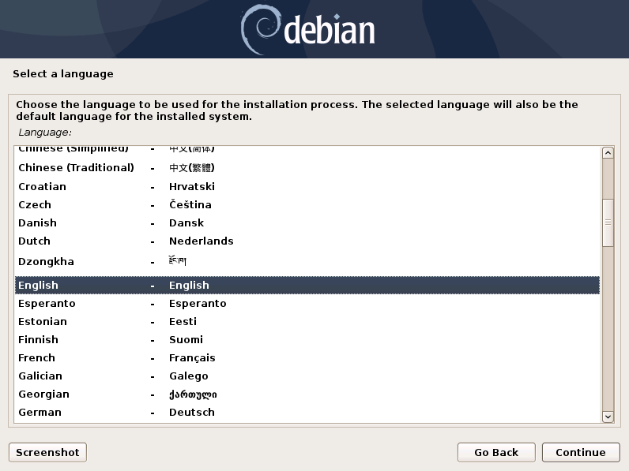
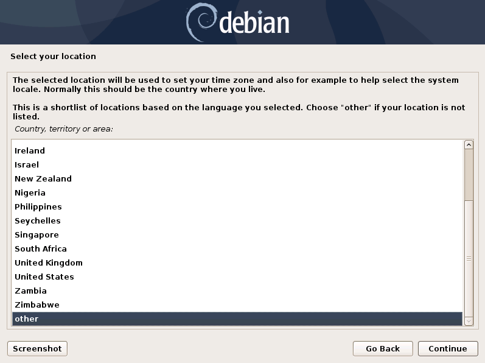
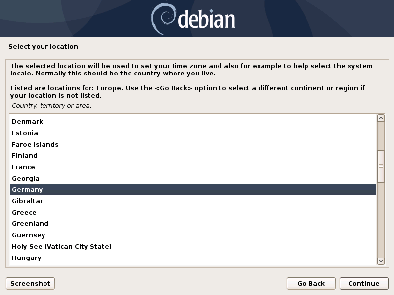
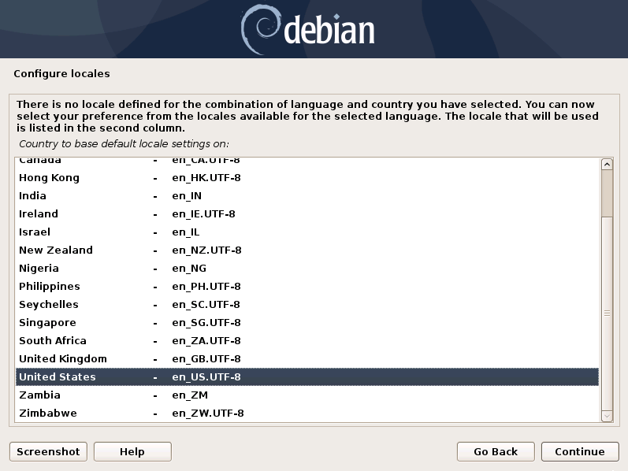

.. index:: Installer

Navigate through the Installer
------------------------------

The installation Process is started by clicking on Graphical install.
The installer then loads the additional components from the ISO and lets you select location and language.

.. warning::
   Please make sure to select the correct Country, as this will also set your local timezone!

.. note::
   If DHCP is available, network parameters will be configured automatically.
   Without DHCP, the installer drops into the manual network configuration dialogue.
   The IP address can be changed later, see :ref:`setup/configure_os:changing the ip-address`