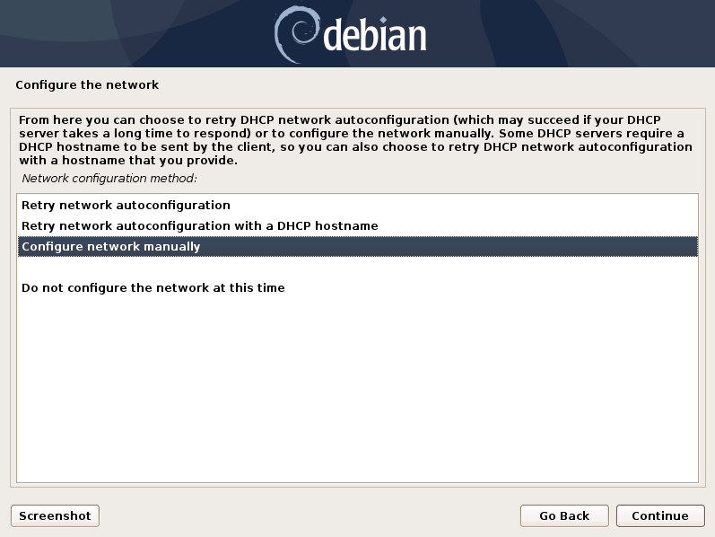
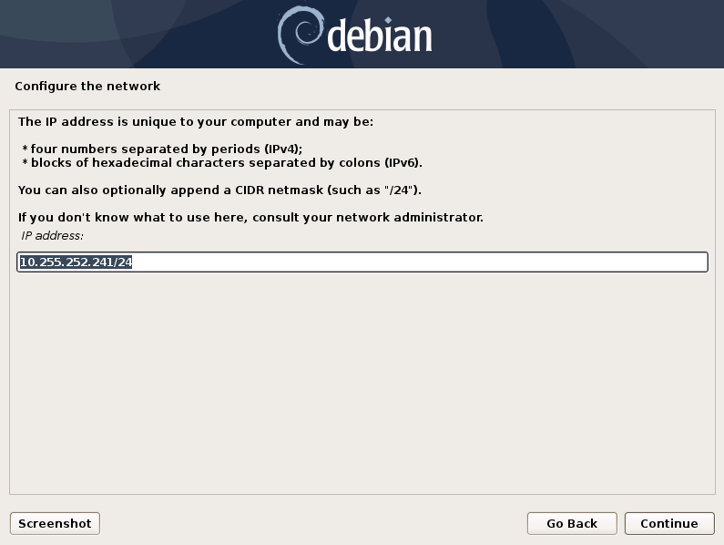
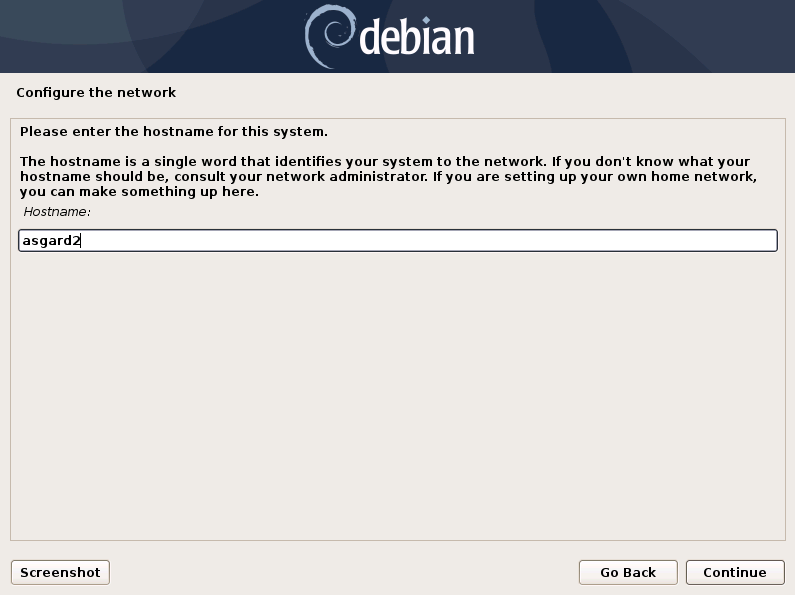

.. index:: Network Configuration

Network Configuration
---------------------

.. figure:: ../images/setup_network1.png
   :alt: Configure the network

.. figure:: ../images/setup_network4.png
   :alt: Configure the network

.. warning::
   The Security Cockpit needs to be able to resolve internal and external IP addresses.

.. figure:: ../images/setup_network5.png
   :alt: Configure the network

.. danger::
   **Important:** Make sure that the combination of hostname and domain
   creates an FQDN that can be resolved from your Analysis Cockpit.
   Connection to ASGARD Analysis Cockpit will rely on the FQDN.

.. figure:: ../images/setup_network7.png
   :alt: Configure the network