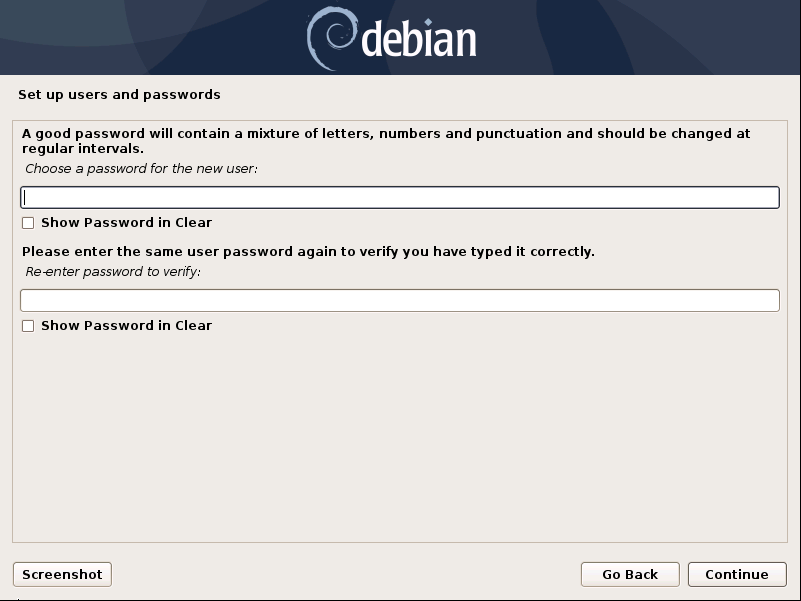
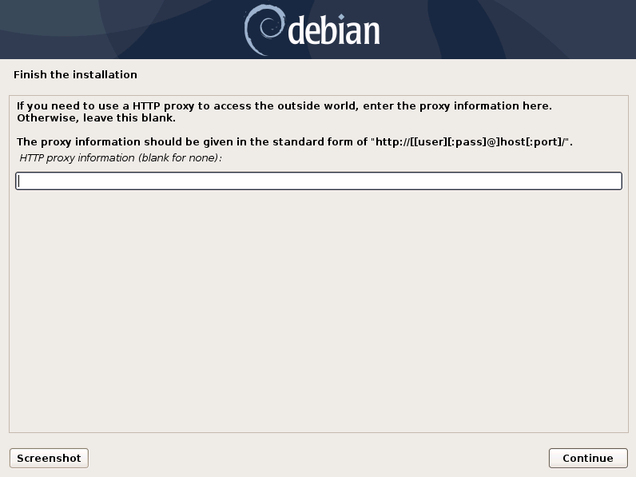

.. index:: Other Setup

Choosing a Password
-------------------

   Choosing a password for the ``nextron`` user

Partitioning of the Hard Disk
-----------------------------

.. figure:: ../images/setup_disks1.png
   :alt: Partition disks

Finally, write your configuration to the disk by selecting "Yes" and clicking "Continue".

.. figure:: ../images/setup_disks2.png
   :alt: Partition disks

If you are using a proxy to access the internet, enter the proxy details
in the next step. Please note, **Internet connectivity is required** for
the next step. 

Proxy Configuration
-------------------

The base installation is now complete. In the next step we will install
the Frontend and Backend Components. For this step **Internet connectivity is required**.

Use SSH to connect to the appliance using the user ``nextron``
and the password you specified during the installation. If SSH is
not available, you can perform the next steps via the Console of
your Virtualization Host, though SSH has better capabilities.