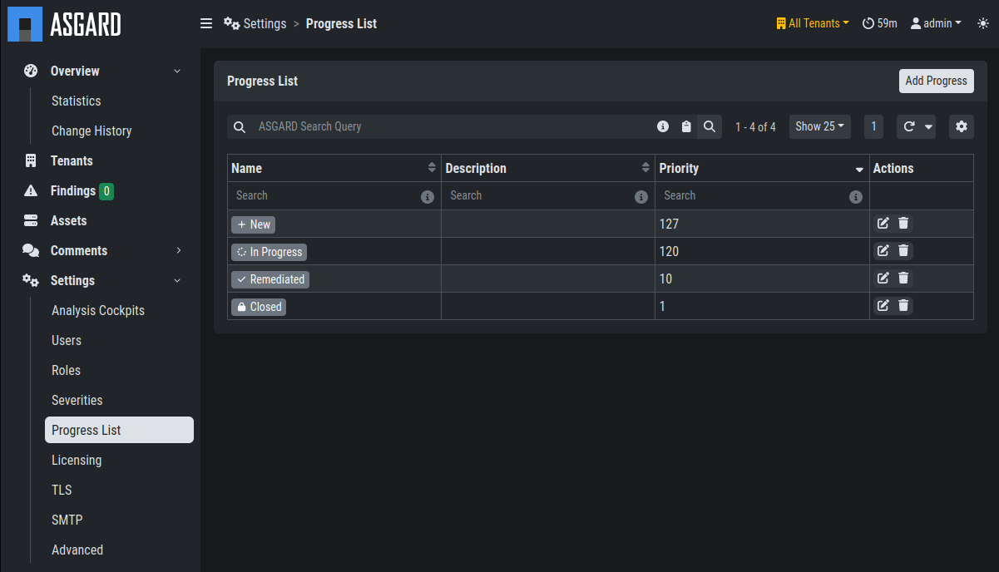
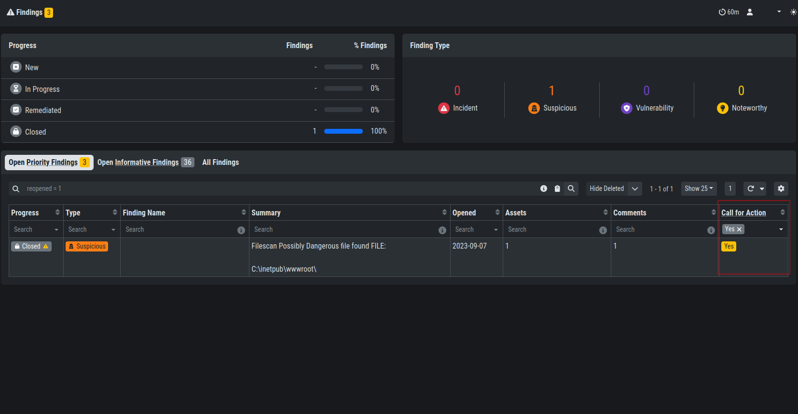
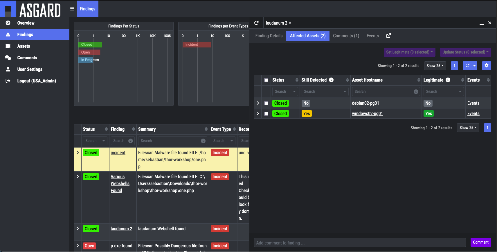
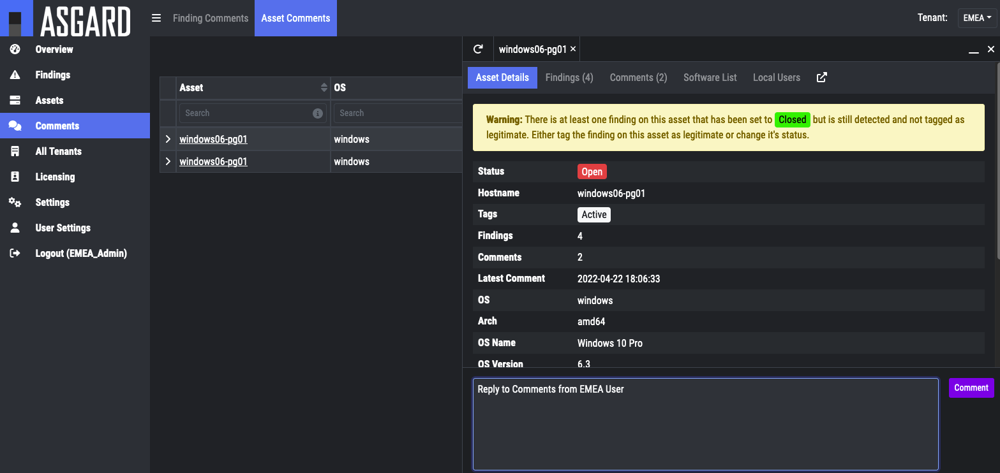

.. index:: Managing Findings

Managing Findings
=================

In this chapter we will describe our **recommended workflow**
for managing findings within your Security Center.

High Level Workflow
^^^^^^^^^^^^^^^^^^^

The default progresses for findings are ``New``, ``In Progress``,
``Remediated`` and ``Closed``. They can be amended or changed
under ``Settings`` > ``Progress List`` to meet the organization's needs.

   Progress List

The ``Priority`` has to be a unique value between **1** and **127**.
The progress with the highest priority will be treated as **Open**,
the progress with the lowest priority will be treated as **Closed**.

Basic Workflow
^^^^^^^^^^^^^^

A basic workflow could look like the following.

- Step 1:
  
  A tenant's security analyst opens a particular finding. Now all
  affected assets are shown in the sidebar. They set the status to
  ``In Progress`` for one or multiple assets within the finding,
  as they are now working on this issue.

  .. figure:: ../images/model_sc-findings.png
   :alt: Findings

   Findings

- Step 2:

  Now the organization works on remediating the finding. Once remediated,
  the status should be changed to ``Remediated``.

- Step 3:

  Ideally the remediation should be confirmed by waiting for the next scan –
  in our working model this is one week as a maximum. If the finding is not
  detected anymore, the ``Still Detected`` flag changes to ``No``. Now the
  finding`s status can be changed to ``Closed``. Once the finding is set to
  ``Closed`` for all endpoints within the finding, the finding`s status will
  automatically change to ``Closed``.

Starting from the Asset View
~~~~~~~~~~~~~~~~~~~~~~~~~~~~

Alternatively, it is possible to start from an asset-based view and start
working on potentially multiple findings on this endpoint. The figure
below shows two different findings on the system windows06-pg01. The findings
can now be selected, and their status can be changed and/or they can be set
to legitimate.

  .. figure:: ../images/model_sc-start-from-asset-view.png
   :alt: Start from Asset View

   Start from Asset View

Using the "Legitimate" Flag
^^^^^^^^^^^^^^^^^^^^^^^^^^^

Sometimes the same finding represents an incident for one customer while
another customer finds the same thing to be legitimate – or at least
legitimate for this particular endpoint. For this reason, a finding that
is not intended to be remediated can also be flagged ``Legitimate``. This
can be done by clicking on the finding and selecting the ``Affected Assets``
tab. One can now select one or multiple assets and change their status or
set the finding to legitimate. 

The "Call for Action" Flag
^^^^^^^^^^^^^^^^^^^^^^^^^^

Let's consider a situation where a finding has been closed but the next
scan finds the very same issue on one endpoint within the finding. In
this case the entire case will be flagged with ``Call for Action``. The
picture below shows a finding that has been set to closed, but we find
it highlighted and the ``Call for Action`` column states ``Yes``.

   Call for Action

However, if a finding has been flagged to be legitimate the ``Call for Action``
flag will not be set. The picture below shows a finding regarding ``Laudanum``
that was detected on two endpoints.

   Example Finding

As we can see, the finding is closed and not highlighted, although it is
still detected on the second asset. The reason for this is that it has
been set to ``Legitimate``.

Using the Comment Function
^^^^^^^^^^^^^^^^^^^^^^^^^^

Comments are intended to be used for communication between a tenant's
employees and the service providers' customer care team. Comments can
be assigned to an asset or to a case.

   Center Comments

Comments are visible to all users assigned to the particular tenant
and to the service provider's administrative users. 