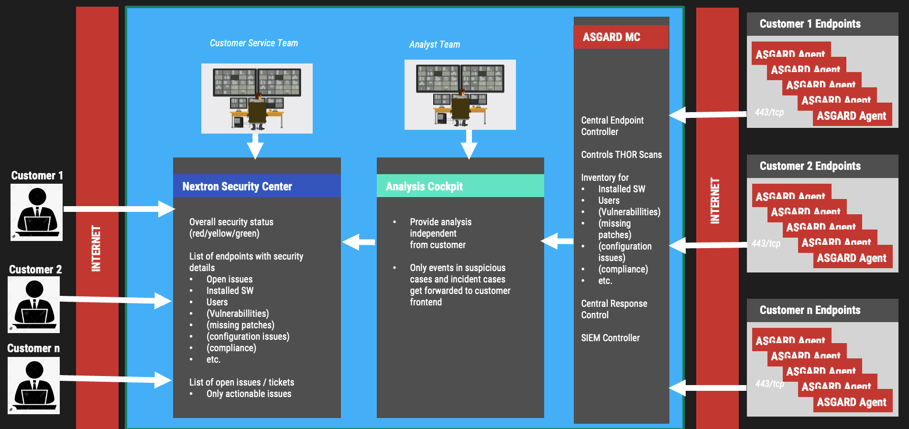

.. index:: Working Model

Working Model
=============

For simplicity's sake, let's consider a scenario
where a service provider scans all endpoints of
all connected tenants on a weekly basis. In our
scenario, the tenants are named EMEA, USA, Customer_XYZ,
and ASIA_CORP. 

The service provider has a team of analysts (Analyst Team),
which is working on the ``Analysis Cockpit`` and is
providing tenant independent valuation of events by
building cases. A second team of security specialists
(Customer Service Team), which is more focused on the
individual tenants/customers, is working on the ``Security
Center``. They provide guidance to individual customers
where needed.

   Working Model

