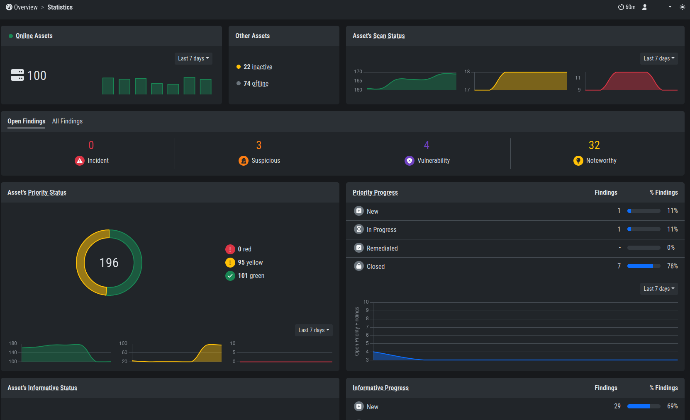
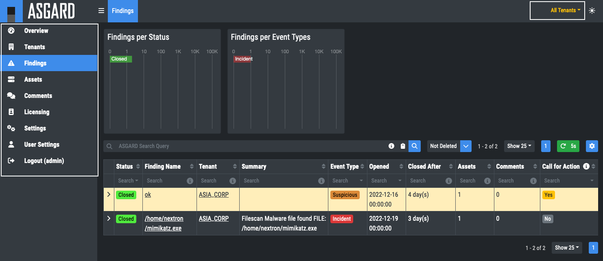

.. index:: Service Provider

Service Provider
================

Service Providers can use the Security Center by logging into the
administrative backend system on port 8443 and setting the desired
tenant in the upper right corner of the overview tab.

Now the sections ``Assets``, ``Findings``, and ``Comments`` only show
information related to this tenant. The picture below shows allocation
to the tenant ``USA``.

   Specific Tenant

.. hint:: 
   You can customize the corresponding tenant view, i.e. if you have
   selected a tenant, only the information about this tenant will be
   displayed (Findings, Assets ...). If you switch to ``All Tenants``
   you will see all information. This applies to the entire navigation
   tree.

   All Tenants