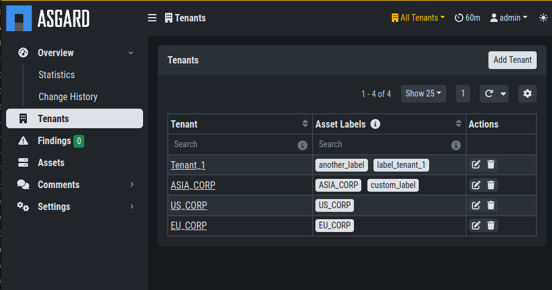

.. index:: Synchronization

Synchronization
===============

In this chapter we will explain how data is being
synchronized between the different components.

Synchronization between Analysis Cockpit and Security Center
^^^^^^^^^^^^^^^^^^^^^^^^^^^^^^^^^^^^^^^^^^^^^^^^^^^^^^^^^^^^

This chapter contains the synchronization of data
between the Analysis Cockpit and the Security Center.

Asset Data
~~~~~~~~~~

Asset data contains endpoint related data like operating
system version, IP addresses, hostname, local users (windows only)
and installed software (windows only).

An endpoint is assigned to a particular tenant based on
the **label set in the ASGARD Management Center**. It is
recommended to prepare custom agent installers for every tenant
with a built-in label. Please see the ASGARD MC manual for details.
This is to ensure an endpoint is automatically assigned to the
correct tenant and human error cannot lead to an endpoint being
assigned to the wrong customer. The mapping between tenant and label
can be found in the chapter :ref:`first_steps/tenants:setting up your first tenant`.

   Tenant Overview

An asset will be assigned to a tenant in the very first moment an
asset shows up with a mappable label. Once mapped to a tenant, the
asset will remain with this tenant forever – even if an asset's label
is changed to another mappable label.

Event Data
~~~~~~~~~~

Event data synchronization is defined in the Analysis Cockpit
(see :ref:`first_steps/analysis_cockpit:configure your analysis cockpit`).
Once a case with the defined type has been set to the defined
status, the case data will be synchronized to the Security Center
and a ``Finding`` will be opened for all assets within this case –
regardless of the affected tenant.

As it is recommended to only synchronize events that are actionable
**AND** fully analyzed, the default criteria for synchronization are
"Incident", "Suspicious" and "Vulnerability" in regards the case type.
By default, only cases with status "Closed" – which stands for "Analysis
is finalized" – are synchronized. However, **the service provider is free
to configure this according to their needs and processes**. 

.. important::
   It is not uncommon that a single case triggers multiple findings for
   multiple assets and multiple tenants. As case data will be copied to
   every finding regardless of the tenant, the analysts must avoid storing
   tenant specific information into the cases' ``assessment`` fields, ``summary``
   fields and ``custom recommendation`` fields.
